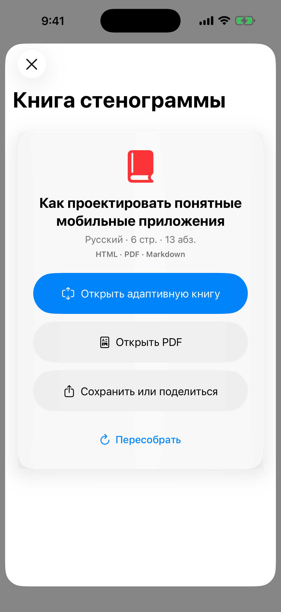
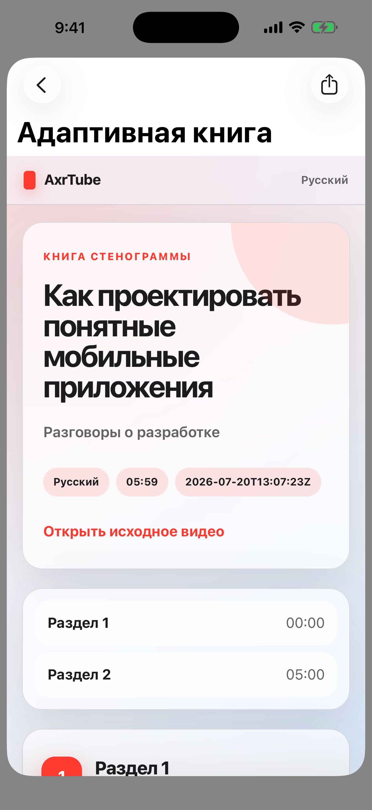
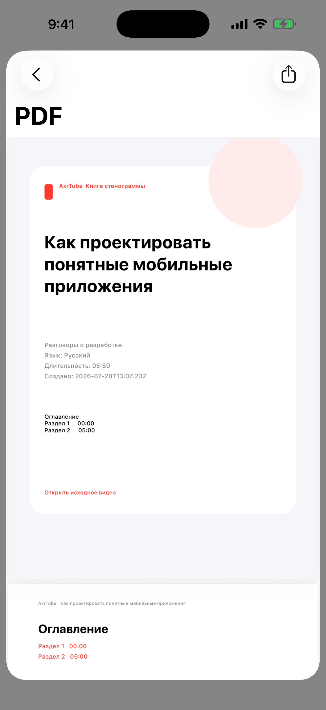

# AxrTube

Open-source аудио-комбайн вокруг YouTube для iPhone. Обычный тап по ролику запускает звук, продолжает загрузку в локальную офлайн-медиатеку и оставляет управление на экране блокировки и в AirPods, без перехода в полноэкранный видеоплеер.

> **Статус:** активная разработка. Проект собирается из исходников; готовые IPA и отдельный обязательный сервер не распространяются.

## Актуальный интерфейс

Снимки сделаны на iPhone 17 Pro Max Simulator с iOS 26.5 из текущего checkout AxrTube.

| Лента | Настройки |
| --- | --- |
|  |  |

| Книга стенограммы | Адаптивная книга | PDF |
| --- | --- | --- |
|  |  |  |

## Возможности

- **Audio-first без рекламного web-player.** Основной путь воспроизводит выбранный медиапоток контента напрямую и не получает расписание pre-roll/mid-roll вставок YouTube. Обычный тап оставляет пользователя в ленте с компактным мини-плеером.
- **Progressive audio и офлайн.** Совместимый поток начинает играть на первых доступных медиабайтах, без требования заранее доказать беспрерывное воспроизведение до конца файла. После реального старта AVPlayer возвращается к системному осторожному buffering, а тот же sparse-cache продолжает возобновляемую локальную загрузку. Ручной «Режим слабой сети» выбирает самый маленький доступный AAC/M4A bitrate, чтобы сократить время до первого звука и общий размер. Карточка текущего трека показывает живое короткое окно реального аудиосигнала и отдельный ползунок перемотки. Позиция каждого ролика сохраняется отдельно и восстанавливается перед следующим запуском воспроизведения. Есть аудио/видео, прогресс, отмена, повтор, удаление, лимит хранилища и время загрузки. Ошибочный источник получает точную причину вместо общего сетевого кода, а непроигрываемая запись не остаётся ложным Now Playing.
- **Устойчивая докачка.** Crash-safe manifest и карта HTTP Range сохраняют подтверждённые байты после потери сети или перезапуска. Аудио resolver сначала использует актуальный JS-less VisionOS-профиль, затем независимые Android VR и Android fallback. Истёкший media URL обновляется тем же владельцем без обязательного старта с нуля, а незавершённые задания сверяются при следующем запуске/возврате приложения.
- **Фон и системное управление.** Background audio, воспроизведение при блокировке, AirPods и системные Play/Pause/Seek работают через стандартную карточку Now Playing. Отдельная playback Live Activity отключена, чтобы на Lock Screen не появлялась дублирующая карточка или полоса. Dynamic Island для воспроизведения оформляет сама iOS. Download-only Live Activity сохраняется для загрузки без активного воспроизведения. Interruption, spoken prompt, Bluetooth route change и media-services reset проходят через одну versioned recovery-модель. После фактического окончания прерывания сохранённое намерение слушать проходит повторную системную активацию; ручная пауза отменяет восстановление. Позиция AVPlayer, ползунок и Now Playing синхронизируются из одного playback clock.
- **Краткая выжимка на Lock Screen.** После готовности книги стенограммы AxrTube сразу показывает короткий локальный фрагмент в стандартной карточке Now Playing. В настройках пользователь вручную выбирает Gemini, DeepSeek или Groq, конкретную модель и отдельный ключ, который хранится в системном Keychain. Автоматического переключения между провайдерами нет. Кэш разделён по провайдеру и модели, cooldown сервиса не вызывает повторных запросов и не оставляет карточку пустой.
- **AxrTube AI Lens.** В карточке готовой книги доступны три режима: несколько уровней разбора, вопросы по текущему ролику и локальный поиск по ранее сохранённым книгам. Ответ на вопрос принимается только с существующими идентификаторами абзацев и показывает проверяемые таймкоды. Поиск по библиотеке работает без сети, а AI не запускает повторное получение субтитров.
- **Читаемый AI Lens.** Режимы «Обзор», «Спросить» и «Связать» отделены от объёма результата «Суть», «Кратко» и «Подробно». Полная главная мысль и готовый разбор доступны для выделения и копирования без молчаливого обрезания, а системная карточка получает отдельную компактную копию.
- **Книга стенограммы.** После получения полной YouTube caption track AxrTube автоматически собирает русскую читаемую книгу. Готовая русская дорожка используется напрямую, а английская переводится встроенным Apple Translation на iPhone без собственного сервера и платного API. Автономный адаптивный HTML подстраивается под iPhone, Android и компьютер, а Markdown UTF-8 и улучшенный PDF с выделяемым поисковым текстом содержат один и тот же русский документ с метаданными, оглавлением, абзацами и ссылками по времени. Перевод и все форматы кэшируются локально.
- **Поиск и медиатека.** Главная, рекомендации, подписки, история, плейлисты и «Каналы» с переходом в ленту выбранного канала. Shorts можно скрыть, а карточки поиска и медиатеки сделать компактными.
- **Только русскоязычные ролики.** Включённый по умолчанию строгий режим явного поиска проверяет доступные YouTube-метаданные аудиодорожек и автоматической транскрипции независимо от языка запроса. Ролики без достаточного подтверждения исключаются; режим можно выключить.
- **Даты публикации.** Карточки используют точную дату из доступных player/watch metadata либо честную относительную подпись YouTube. Ленты сортируются от новых роликов к старым там, где источник не задаёт пользовательский порядок; неизвестные даты остаются в конце.
- **Девять цельных тем, Liquid Glass и haptics.** Прежние режимы «Системная / Тёмная / Светлая» полностью заменены темами «Матрица», «Монохром», «Хронология», «Сияние, ночь», «Сияние, день», «Орбита», «Живой постер», «Сигнал» и «Призма». Темы меняют фон, обработку превью и компоновку ленты как единый контракт. Matrix и светлый монохром используют чёрно-белые превью с мягким зелёным оттенком, хронология добавляет временную ось, два режима сияния подхватывают цвета ролика, а четыре смелых темы используют объёмные, постерные, информационные и спектральные композиции. Рамки вокруг обычных карточек не возвращаются. На iOS 26 навигация, поиск, tab bar, mini-player и основные действия используют системный Liquid Glass. Семантическая тактильность различает выбор, транспорт, успех, предупреждение, ошибку и разрушительное подтверждение, не вибрируя при прокрутке или пассивном прогрессе.
- **Дополнения.** SponsorBlock, DeArrow, Share Extension и Safari Web Extension для передачи YouTube-ссылок в AxrTube.
- **Аккаунт.** Google/YouTube device-code flow открывает подписки, историю и плейлисты. Выход выполняется как версионированная транзакция: запоздавший refresh, cookie exchange или API callback старой сессии не может восстановить завершённую авторизацию.

## Честные ограничения

- Проект использует неофициальный YouTube/InnerTube backend. YouTube может изменить ответы, форматы и ограничения без уведомления и временно нарушить поиск, metadata или получение медиапотока.
- Не каждый возрастной, региональный, платный, DRM-защищённый или иной restricted-ролик доступен.
- YouTube не всегда возвращает точную дату публикации или доказательные сведения о языке аудио. AxrTube не подставляет выдуманные значения и в строгом русскоязычном поиске исключает неопределённые результаты.
- Отсутствие рекламных вставок относится к текущему собственному playback-пути AxrTube. Проект не обещает вечную совместимость с будущими механизмами YouTube.
- iOS не гарантирует продолжение фоновой передачи после явного force-quit пользователем; задания сверяются при следующем запуске.
- Если фактическая скорость соединения долго остаётся ниже bitrate даже минимального потока, физически невозможно слушать без пауз бесконечно. Режим слабой сети уменьшает требуемую скорость и разрешает ранний старт, а AVPlayer честно добирает буфер при исчерпании уже загруженных данных.
- Внешний вид системной карточки Now Playing определяет iOS. AxrTube передаёт стандартные metadata и команды, но не может добавить в неё произвольную разметку или анимацию.
- ActivityKit не позволяет оставить playback Live Activity только в Dynamic Island и скрыть её обязательное представление на Lock Screen. Поэтому пользовательская playback Live Activity полностью отключена, а приложение оставляет одну системную карточку Now Playing.
- AxrTube не обходит DRM и не публикует cookies, токены или подписанные media URL. Сохраняйте только контент, на загрузку и использование которого у вас есть право.

## Сборка из исходников

Требуются Xcode 26+, iOS 26+ и собственная Apple Developer Team для подписи на физическом устройстве.

```bash
git clone https://github.com/axrbarsic/AxrTube.git
cd AxrTube
open AxrTube.xcworkspace
```

1. Выберите схему `iPocketTube` и свой iPhone.
2. В `Signing & Capabilities` назначьте собственную Team и включите automatic signing для приложения и пользовательских extensions.
3. Соберите и запустите приложение из Xcode.

Схема, Swift modules, bundle identifiers, App Group, URL schemes и внутренние target paths всё ещё используют историческое техническое имя `iPocketTube`. Эти идентификаторы намеренно сохранены для совместимости с подписью, extensions, deep links, кэшем и существующими данными приложения. Пользовательский продукт, публичные корневые каталоги и репозиторий называются AxrTube.

Не коммитьте Team ID, provisioning profiles, сертификаты, токены и приватные конфиги. Firebase не обязателен для персональной сборки; если вы подключаете Firebase/Crashlytics самостоятельно, используйте собственный игнорируемый `GoogleService-Info.plist`.

## Структура проекта

```text
AxrTube/              Swift Package: модели, InnerTube, playback/download state, SwiftUI
AxrTubeApp/           Xcode project: iOS app, Share/Safari extensions, Live Activity
AxrTube.xcworkspace/  Рабочее пространство Xcode
```

Адресные тесты Swift Package:

```bash
swift test --package-path AxrTube
```

## Происхождение и лицензия

AxrTube основан на проекте [milika/SmartTubeIOS](https://github.com/milika/SmartTubeIOS); исходные copyright notices и история upstream сохранены.

Код распространяется по [GNU GPL v3](LICENSE). Проект не аффилирован с Google LLC или YouTube. YouTube является товарным знаком соответствующего правообладателя.

- [Политика конфиденциальности](PRIVACY_POLICY.md)
- [Поддержка и сообщения об ошибках](https://github.com/axrbarsic/AxrTube/issues)
- [Обсуждения](https://github.com/axrbarsic/AxrTube/discussions)
