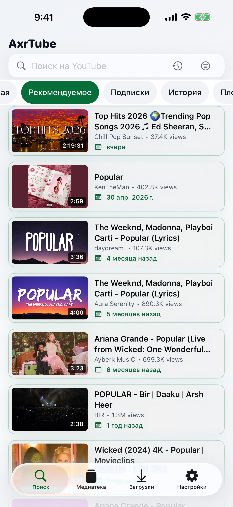
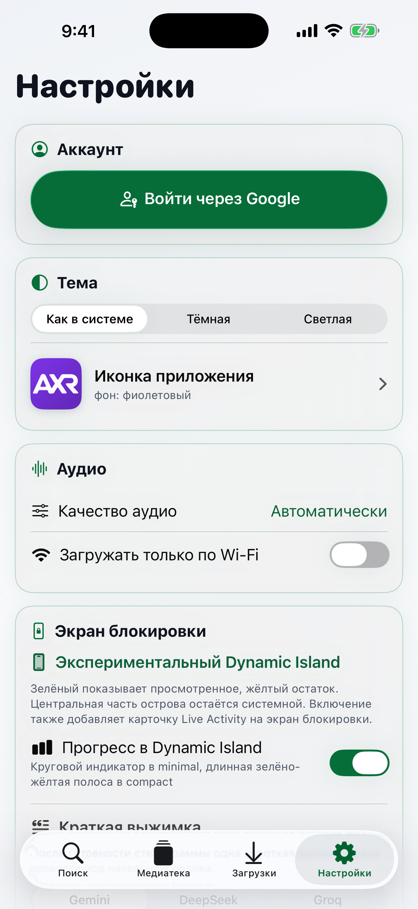

# AxrTube

Open-source видеоплеер и офлайн-медиатека вокруг YouTube для iPhone. Треугольник в ленте запускает видео внутри превью и ставит его на офлайн-сохранение. Сам баннер не открывает fullscreen.

> **Статус:** активная разработка. Проект собирается из исходников; готовые IPA и отдельный обязательный сервер не распространяются.

## Обновление, 9 сентября 2026

В компактных карточках ленты и загрузок заголовок больше не ограничен одной или двумя строками: маленькое превью сохраняется, а высота карточки подстраивается под весь текст. Убраны вложенные ленивые контейнеры сеток, связанные с пустыми промежутками между рядами.

При переключении офлайн-роликов сбрасывается ожидание качества предыдущего видео. Готовый файл открывается до сетевой подготовки, устаревшие события не подменяют новый ролик и не отменяют его визуализацию. Перемотка синхронизируется с реальной позицией плеера. Адресный тест A → B → перемотка прошёл; подписанная сборка установлена по USB и запущена на iPhone без удаления данных. Визуальный вердикт пользователя ожидается, это кандидат обновления, не объявление полной приёмки.

Первый этап архитектурного рефакторинга отделяет очередь скачивания от текущего плеера и интерфейса. Адресная отмена, запоздалые ответы, восстановление задач и аудиопрерывания проходят через проверяемые границы состояния. Скрытые веб-компоненты получения ссылок не воспроизводят медиа; неподтверждённый рекламный источник не используется как запасной плеер.

Исправлена отдельная ошибка локального видео: длительность теперь поступает от текущего `AVPlayerItem`, даже если в записи загрузки указано `0`. Таймлайн показывает измеренную позицию плеера, а живой сигнал не блокируется ожиданием длительности. Проверено адресными тестами и на одном iPhone 17 Pro Max Simulator. Правка вошла в установленную на iPhone сборку от 9 сентября.

- [Что изменено](CHANGELOG.md)
- [Архитектура, проверки и оставшиеся задачи](docs/RELIABILITY_ARCHITECTURE.md)
- [Порядок разработки, публикации и отката](docs/DEVELOPMENT_WORKFLOW.md)

Это не заявление о завершении полного рефакторинга. Прохождение тестов и сборки отмечается отдельно от физической проверки звука, сети и интерфейса на iPhone.

## Актуальный интерфейс

Медиатека выполняет безопасную сверку локальных путей при запуске, возвращении на экран и каждую минуту активной работы. Однозначно найденные готовые файлы возвращаются в записи без повторной загрузки. Автоматика не удаляет медиа и не выбирает между несколькими кандидатами.

Текущий этап устойчивости загрузок: для совместимых прямых файлов добавлен журнал проверенных диапазонов, для временных сетевых ошибок предусмотрены ограниченные автоповторы. HLS использует системную фоновую сессию Apple. Автоматическое повышение качества пока не реализовано, физическая проверка обрывов связи ожидается. Подробности: [план и ограничения](docs/OFFLINE_RELIABILITY_PLAN.md).

Снимки предыдущей версии сделаны на iPhone 17 Pro Max Simulator с iOS 26.5. На физическом iPhone проверены открытие полной стенограммы и видимость обеих кнопок. Само копирование и сохранение файла ещё требуют пользовательской приёмки.

| Лента | Настройки |
| --- | --- |
|  |  |


## Возможности

- **Фильтры и звук.** «Только русский» в фильтрах рядом с поиском действует на поиск, главную и рекомендации iPhone, скрывая неизвестный язык. В настройках можно заменить столбики эквалайзера кривой реального PCM-сигнала. Доступность сигнала зависит от текущего аудиопотока.

- **Любимые каналы.** Булавка в списке каналов закрепляет канал сверху. Закрепления хранятся на устройстве и доступны даже при неполном ответе каталога YouTube.

- **Video-first playback.** Один `AVPlayer` отвечает за сетевое и локальное видео. Полноэкранный экран и компактное окно используют один живой player layer, поэтому второй аудиоплеер не запускается.
- **Нативная офлайн-медиатека.** AxrTube предпочитает HLS и сохраняет его системной `AVAssetDownloadURLSession`; прямой muxed MP4 загружается фоновой `URLSessionDownloadTask`. Координатор очереди отделён от транспорта и выбранного ролика. Заявки сохраняются до начала сети, отмена адресуется конкретному ролику, отложенный повтор не удерживает остальные задачи. Адаптированные из Brave компоненты сохраняют MPL attribution, но происхождение кода не определяет продуктовую архитектуру.
- **Локальное видео без сети.** Завершённая HLS-папка или MP4 открывается тем же player owner напрямую с диска. Старые M4A не удаляются при обновлении, но новый production flow их не создаёт, не показывает и не возобновляет.
- **Фон и системное управление.** Background audio, воспроизведение при блокировке, AirPods и системные Play/Pause/Seek работают через стандартную карточку Now Playing. Отдельные playback и download Live Activity отключены, чтобы на Lock Screen не появлялись дублирующие карточки или полосы. Dynamic Island для воспроизведения оформляет сама iOS. Interruption, spoken prompt, Bluetooth route change и media-services reset проходят через одну versioned recovery-модель. После фактического окончания прерывания сохранённое намерение слушать проходит повторную системную активацию; ручная пауза отменяет восстановление. Позиция AVPlayer, ползунок и Now Playing синхронизируются из одного playback clock.
- **Без настройки AI-провайдеров.** Выжимка для Lock Screen, выбор Gemini/DeepSeek/Groq и ввод API-ключей удалены из действующего пользовательского сценария. Полная стенограмма не требует ключа внешнего AI-сервиса. Ранее сохранённые ключи не стираются при обновлении.
- **Полная стенограмма.** Кнопка «Показать стенограмму» сразу открывает весь готовый текст. Внутри только «Копировать всё» и «Сохранить Markdown». Новые PDF/HTML не создаются, ранее сохранённые документы не удаляются. Русские субтитры используются напрямую, английские переводятся системным Apple Translation. Готовый Markdown кэшируется, чтение из загрузок не запускает видео. Открытие текста и видимость кнопок проверены на физическом iPhone; копирование и экспорт отдельно ещё не проверены.
- **Поиск и медиатека.** Главная, рекомендации, подписки, история, плейлисты и «Каналы» с переходом в ленту выбранного канала. Shorts можно скрыть, а карточки поиска и медиатеки сделать компактными.
- **Только русскоязычные ролики.** Включённый по умолчанию строгий режим явного поиска проверяет доступные YouTube-метаданные аудиодорожек и автоматической транскрипции независимо от языка запроса. Ролики без достаточного подтверждения исключаются; режим можно выключить.
- **Даты публикации.** Карточки используют точную дату из доступных player/watch metadata либо честную относительную подпись YouTube. Ленты сортируются от новых роликов к старым там, где источник не задаёт пользовательский порядок; неизвестные даты остаются в конце.
- **Девять цельных тем, Liquid Glass и haptics.** Прежние режимы «Системная / Тёмная / Светлая» полностью заменены темами «Матрица», «Монохром», «Хронология», «Сияние, ночь», «Сияние, день», «Орбита», «Живой постер», «Сигнал» и «Призма». Темы меняют фон, обработку превью и компоновку ленты как единый контракт. Matrix и светлый монохром используют чёрно-белые превью с мягким зелёным оттенком, хронология добавляет временную ось, два режима сияния подхватывают цвета ролика, а четыре смелых темы используют объёмные, постерные, информационные и спектральные композиции. Рамки вокруг обычных карточек не возвращаются. На iOS 26 навигация, поиск, tab bar, mini-player и основные действия используют системный Liquid Glass. Семантическая тактильность различает выбор, транспорт, успех, предупреждение, ошибку и разрушительное подтверждение, не вибрируя при прокрутке или пассивном прогрессе.
- **Дополнения.** SponsorBlock, DeArrow, Share Extension и Safari Web Extension для передачи YouTube-ссылок в AxrTube.
- **Аккаунт.** Google/YouTube device-code flow открывает подписки, историю и плейлисты. Выход выполняется как версионированная транзакция: запоздавший refresh, cookie exchange или API callback старой сессии не может восстановить завершённую авторизацию.

## Честные ограничения

- Проект использует неофициальный YouTube/InnerTube backend. YouTube может изменить ответы, форматы и ограничения без уведомления и временно нарушить поиск, metadata или получение медиапотока.
- Не каждый возрастной, региональный, платный, DRM-защищённый или иной restricted-ролик доступен.
- YouTube не всегда возвращает точную дату публикации или доказательные сведения о языке аудио. AxrTube не подставляет выдуманные значения и в строгом русскоязычном поиске исключает неопределённые результаты.
- Отсутствие рекламных вставок относится к текущему собственному playback-пути AxrTube. Проект не обещает вечную совместимость с будущими механизмами YouTube.
- iOS не гарантирует продолжение фоновой передачи после явного force-quit пользователем; задания сверяются при следующем запуске.
- Переключатель «Загружать только по Wi-Fi» пока не подключён к новому нативному транспорту. Он не гарантирует запрет мобильного трафика. Автоматическая экономичная копия с последующим улучшением качества также остаётся задачей следующего этапа.
- Если фактическая скорость соединения долго остаётся ниже bitrate выбранного видеопотока, AVPlayer будет добирать буфер. Полностью завершённое локальное видео от сети не зависит.
- Внешний вид системной карточки Now Playing определяет iOS. AxrTube передаёт стандартные metadata и команды, но не может добавить в неё произвольную разметку или анимацию.
- ActivityKit не позволяет оставить playback Live Activity только в Dynamic Island и скрыть её обязательное представление на Lock Screen. Поэтому пользовательская playback Live Activity полностью отключена, а приложение оставляет одну системную карточку Now Playing.
- AxrTube не обходит DRM и не публикует cookies, токены или подписанные media URL. Сохраняйте только контент, на загрузку и использование которого у вас есть право.

## Сборка из исходников

Требуются Xcode 26+, iOS 26+ и собственная Apple Developer Team для подписи на физическом устройстве.

```bash
git clone https://github.com/axrbarsic/AxrTube.git
cd AxrTube
open AxrTube.xcworkspace
```

1. Выберите схему `iPocketTube` и свой iPhone.
2. В `Signing & Capabilities` назначьте собственную Team и включите automatic signing для приложения и пользовательских extensions.
3. Соберите и запустите приложение из Xcode.

Схемы, Swift modules, внутренние target paths, URL schemes и App Group используют техническое имя `iPocketTube`; сами bundle identifiers: `com.alexlane.smarttube.local*`. Эти идентификаторы намеренно сохранены для совместимости с подписью, extensions, deep links, кэшем и существующими данными приложения. Пользовательский продукт, публичные корневые каталоги и репозиторий называются AxrTube.

Не коммитьте Team ID, provisioning profiles, сертификаты, токены и приватные конфиги. Firebase не обязателен для персональной сборки; если вы подключаете Firebase/Crashlytics самостоятельно, используйте собственный игнорируемый `GoogleService-Info.plist`.

## Структура проекта

```text
AxrTube/              Swift Package: модели, InnerTube, playback/download state, SwiftUI
AxrTubeApp/           Xcode project: iOS app, Share/Safari extensions, Live Activity
AxrTube.xcworkspace/  Рабочее пространство Xcode
```

Адресные тесты Swift Package:

```bash
swift test --package-path AxrTube
```

## Происхождение и лицензия

AxrTube основан на проекте [milika/SmartTubeIOS](https://github.com/milika/SmartTubeIOS); исходные copyright notices и история upstream сохранены. Фоновая HLS/file download цепочка, восстановление задач, HTTP request shape и MIME detection адаптированы из открытого Brave iOS Playlist с сохранением Mozilla Public License 2.0. Точная ревизия и список производных файлов приведены в [Brave Playlist attribution](docs/BRAVE_PLAYLIST_ATTRIBUTION.md).

Код распространяется по [GNU GPL v3](LICENSE). Проект не аффилирован с Google LLC или YouTube. YouTube является товарным знаком соответствующего правообладателя.

- [Политика конфиденциальности](PRIVACY_POLICY.md)
- [Поддержка и сообщения об ошибках](https://github.com/axrbarsic/AxrTube/issues)
- [Обсуждения](https://github.com/axrbarsic/AxrTube/discussions)
